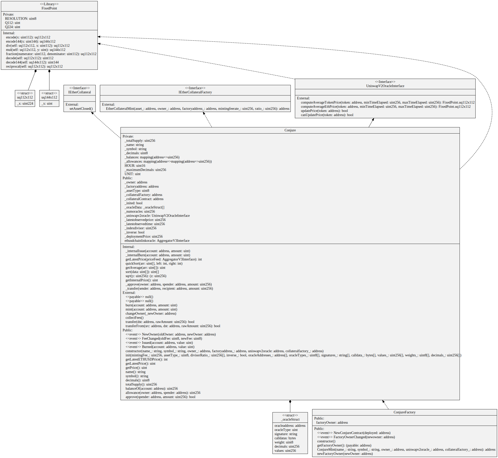
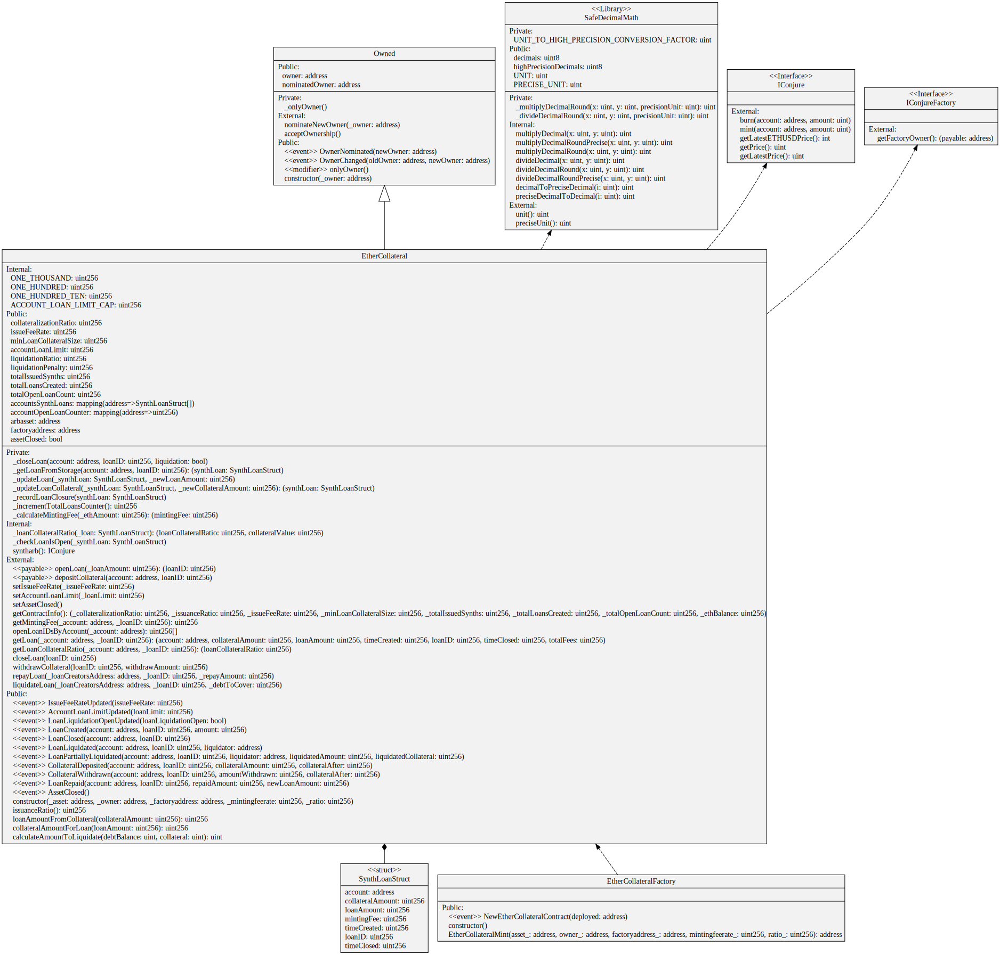
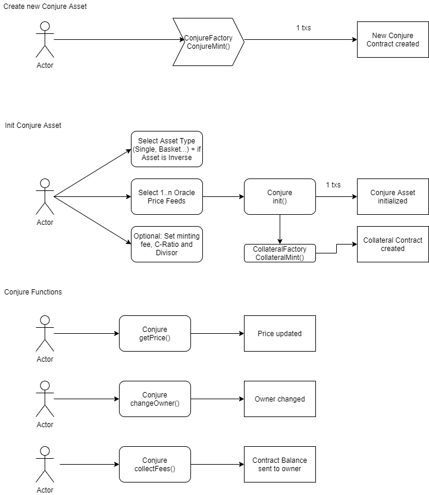
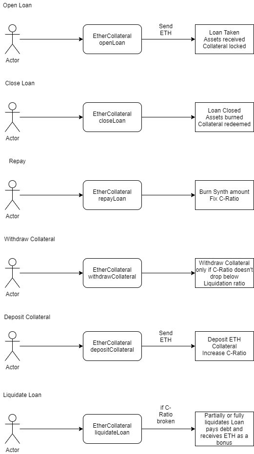
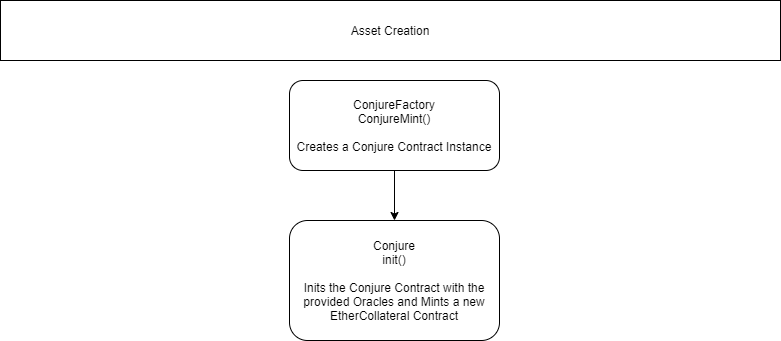
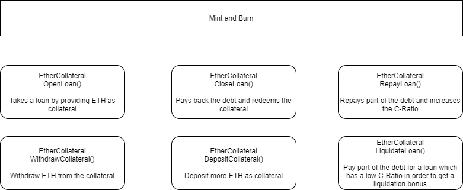

# Conjure
[](https://twitter.com/ConjureFi/)
[](https://travis-ci.com/ConjureFi/contracts-main)
[](https://coveralls.io/github/ConjureFi/contracts-main?branch=main)

Repository for the Conjure Contracts


## Gitbook
The technical documentation can be found here: [https://docs.conjure.finance/](https://docs.conjure.finance/)

## Dapps
You can find the rinkeby version of the Conjure Dapp here: [https://rinkeby.conjure.finance/](https://rinkeby.conjure.finance/)

## Bug Bounty
A bug bounty for $20,000 during the first week for the soft launch, and $50,000 after will be rewarded for any critical vulnerabilities found within the Conjure and EtherCollateral contracts within this repo. The scope is only within these contracts and assumes that the oracles provided to an asset are reliable, secure and fully functional, only the contracts are within scope for the bounty. Smaller rewards are available for information-major vulnerabilities as well as other contracts, however these are subject to the security teams discretion. For any found vulnerabilities the contacts are:
Email
contact@conjure.finance
Discord (case sens)
jimmix
#3056
PR0#9619


# Setup

## Install the dependencies
```
npm install
```

## Testing
The contracts can be tested by running the corresponding tests from the hardhat test folder with a total of 104 unit tests.
```
npx hardhat test
```

## Coverage
The contracts coverage can be run through:
```
npx hardhat coverage
```

## Deployment
The 2 Solidity Files which act as the Factory Contracts for all assets can be deployed by using the scripts in the scripts folder using
```
npx hardhat run --network NETWORK scripts/deploy_conjurefactory.js
npx hardhat run --network NETWORK scripts/deploy_collateralfactory.js
```

## UML Class Diagrams

### ConjureFactory.sol



### EtherCollateralFactory.sol



## Flow Diagrams

### Conjure Functions



### EtherCollateral Functions



### Asset Creation



### Mint and Burn


