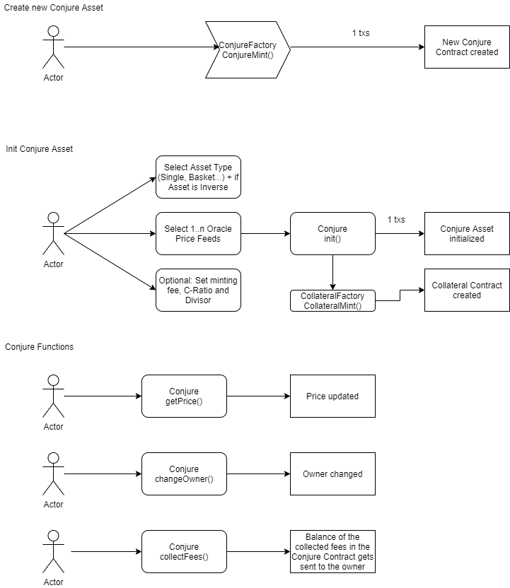

# Conjure
[](https://twitter.com/ConjureFi/)
[](https://travis-ci.com/ConjureFi/contracts-main)

Repository for the Conjure Contracts


## Gitbook
The technical documentation can be found here: [https://docs.conjure.finance/](https://docs.conjure.finance/)

## Dapps
You can find the rinkeby version of the Conjure Dapp here: [https://rinkeby.conjure.finance/](https://rinkeby.conjure.finance/)

# Setup

## Install the dependencies
```
npm install
```

## Testing
The contracts can be tested by running the corresponding tests from the hardhat test folder with a total of 51 unit tests.
```
npx hardhat test
```

## Coverage
The contracts coverage can be run through:
```
npx hardhat coverage
```

## Deployment
The 2 Solidity Files which act as the Factory Contracts for all assets can be deployed by using the scripts in the scripts folder using
```
npx hardhat run --network NETWORK scripts/deploy_conjurefactory.js
npx hardhat run --network NETWORK scripts/deploy_collateralfactory.js
```

## UML Class Diagrams

### ConjureFactory.sol


### EtherCollateralFactory.sol


## Flow Diagrams

### Conjure Functions



### EtherCollateral Functions


### Asset Creation


### Mint and Burn


